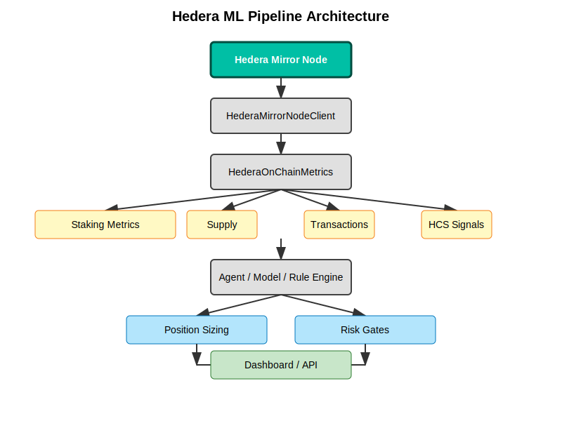

# Architecture

System design and component relationships for the Hedera ML Pipeline.

## High-Level Design



```
                        Hedera Network
                             │
              ┌──────────────┼──────────────┐
              │              │              │
         Consensus       Mirror Nodes    HCS Topics
              │              │              │
              └──────────────┼──────────────┘
                             │
                    ┌────────▼────────┐
                    │  MirrorNodeClient│  (mirror_node.py)
                    │  • Async HTTP    │
                    │  • No auth       │
                    │  • Rate limited  │
                    └────────┬────────┘
                             │
                    ┌────────▼────────┐
                    │ OnChainMetrics  │  (metrics.py)
                    │  • Aggregation  │
                    │  • Processing   │
                    │  • Parallel I/O │
                    └────────┬────────┘
                             │
              ┌──────────────┼──────────────┐
              │              │              │
     ┌────────▼───────┐ ┌───▼────────┐ ┌───▼──────────┐
     │ PositionSizing │ │   Risk     │ │  External     │
     │  • Kelly       │ │ Management │ │  • ML Model   │
     │  • Fixed Frac  │ │ • Stops    │ │  • LLM        │
     └────────┬───────┘ │ • Limits   │ │  • Heuristic  │
              │         └───┬────────┘ └───┬───────────┘
              │             │              │
              └─────────────┼──────────────┘
                            │
                   ┌────────▼────────┐
                   │    Execution    │
                   │  • Order sizing │
                   │  • Risk checks  │
                   │  • Position mgmt│
                   └─────────────────┘
```

## Component Details

### 1. HederaMirrorNodeClient (`mirror_node.py`)

**Purpose:** Low-level async HTTP client for Hedera Mirror Node REST API.

**Design decisions:**
- Async context manager pattern for connection lifecycle
- Network-agnostic (mainnet/testnet/previewnet via constructor)
- Thin wrapper — returns raw JSON, no transformation
- Rate limit aware (50 req/s on mainnet)

**Dependencies:** `aiohttp`

### 2. HederaOnChainMetrics (`metrics.py`)

**Purpose:** Aggregates raw Mirror Node data into structured trading metrics.

**Design decisions:**
- Parallel fetching via `asyncio.gather` for latency optimization
- Tinybar → HBAR conversion (÷ 1e8)
- Graceful degradation on individual endpoint failures
- Optional HCS topic integration

**Dependencies:** `mirror_node.py`

### 3. Position Sizing (`position_sizing.py`)

**Purpose:** Calculate optimal position sizes based on portfolio and confidence.

**Strategies:**
- **Kelly Criterion:** Maximizes long-term growth. Formula: f* = (bp - q) / b
- **Fixed Fraction:** Simpler, confidence-adjusted allocation

**Design decisions:**
- Half-Kelly by default (conservative)
- Confidence-based win rate adjustment (±10%)
- Hard caps on max fraction (2%)
- Pure computation — no I/O, no state

**Dependencies:** `numpy`

### 4. Risk Management (`risk_management.py`)

**Purpose:** Enforce trading risk limits and calculate exit prices.

**Features:**
- Stop-loss / take-profit price calculation
- Daily loss limit enforcement
- Concurrent position cap
- Stateful daily P&L tracking

**Design decisions:**
- Mutable state (daily_pnl, position_count) — caller manages lifecycle
- Direction-aware calculations (long vs short)
- Boolean gate for position entry decisions

**Dependencies:** None (stdlib only)

## Data Flow

```
1. User/System triggers update
2. HederaMirrorNodeClient fetches raw data (parallel)
3. HederaOnChainMetrics transforms to structured metrics
4. Metrics fed to external model (ML/LLM/heuristic) for signal
5. Signal + confidence → PositionSizing.calculate()
6. RiskManagement.should_open_position() gates execution
7. If approved, RiskManagement calculates stop/take prices
8. Execution layer places order with calculated size and risk params
```

## Integration Points

### With ML Models
The pipeline is model-agnostic. Any system that produces (action, confidence) tuples can integrate:

```python
action, confidence = model.predict(features)
position = kelly.calculate(portfolio, price, confidence)
if risk.should_open_position():
    execute(position, risk.calculate_stop_loss(price))
```

### With HCS (Hedera Consensus Service)
Topic messages can serve as signal sources:

```python
hcs_data = await metrics.get_hcs_signals(["0.0.12345"])
# Parse signals, extract sentiment/action
```

### With External Data Sources
The metrics output can be combined with price data, sentiment, or other features before feeding to a model.

## Performance Characteristics

| Component | Bottleneck | Optimization |
|-----------|-----------|-------------|
| Mirror Node fetch | Network I/O | Parallel requests |
| Metrics aggregation | CPU (minimal) | Already optimized |
| Position sizing | CPU (negligible) | N/A |
| Risk management | CPU (negligible) | N/A |

**End-to-end latency:** ~30ms for full pipeline (fetch + process + size + risk).
